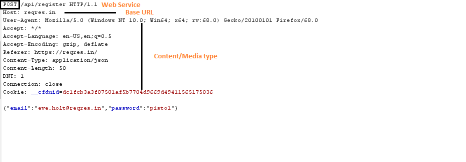
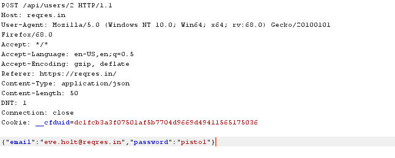
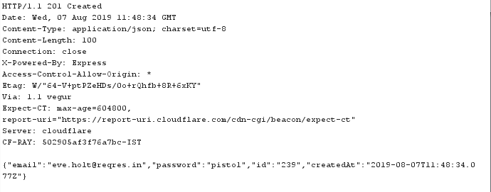

Günümüzde Web servis olarak (RESTful API) eskiye nazaran daha fazla uygulama geliştirilmektedir. Günümüzde web servislerin yer aldığı bir mimaride test yapan kişiler aslında nasıl test edileceğini ve gerçekte neleri arayıp bulmaları konusunda fikir sahibi olmaya biliyorlar. RESTful API'lara nasıl saldırılar yapacağımızı keşfetmeden önce RESTful API'nın temelde ne yaptığını ve nasıl yaptığını öğrenmemiz gerekiyor.

## RESTful API Nedir?

RESTful API'ını anlamadan önce, REST teriminin gerçekte ne anlama geldiğini öğrenmemiz gerekiyor.

### REST

REST (Representational State Transfer) Client-Server iletişimi yapabileceğimiz bir mimaridir. SOAP'daki gibi *sabit URL* ile metotlar üzerinden iletişim kurulur. REST'de ise *değişken URL* ile metotlar üzerinden iletişim kurulur.

Örn:
```
http://SERVER-IP/api/Kisiler
http://SERVER-IP/api/Adresler
http://SERVER-IP/api/Adresler/1
http://SERVER-IP/api/Kimlikler

```
Yukarıdaki gibi metotlar çağırılarak kullanılır.

Bir RESTful Servisinin taşıması gereken karakteristik bazı prensipleri vardır;

- <strong>Client/Server:</strong> Client, Server hakkında; Server, Client hakkında bir şey bilmez.
- <strong>Stateless:</strong> Sunucu tarafından client'a ait hiçbir bilgi tutulmaz. Web sitesi geliştiren arkadaşlar SESSION kavramına aşinadır. Kullanıcının oturum açıp açmadığı SESSION üzerinden kontrol edilir. Burada bu gibi bir durum yoktur. Sunucu tarafından Client hakkında herhangi bir bilgi tutulmayacağı için Server ve Client arasında sürekli olarak bir durum bildirimi söz konusudur.
- <strong>Cacheable:</strong> Sunucu tarafında response üzerinden cache'lenebilirliği gönderilir ve client veriyi cache'leyebilir. Client'a verinin expire olma süresi de sunulabilir. 
- <strong>Layered System:</strong> Client'ın sunucu tarafında hangi katman ile iletişime geçtiği bilinmemektedir.
- <strong>Uniforma Interface:</strong> Client'ın sunucu arasında bir URI formatında arayüz bulunmasıdır.
- <strong>Code on Demand:</strong> Bu özellik opsiyoneldir. Response olarak Client-Side Script gönderilmesidir. Buna örnek vererek anlatmak istersek. Tarayıcı üzerinden gitmiş olduğunuz bir sitede, site bilgisayar üzerinden bir programı çalıştırmak istemesi olarak örnekleyebiliriz.

Bu prensiplere uymak RESTful olarak adlandırılır. REST'i anladıktan sonra, RESTful Web Servis API'ına bir göz atalım.

## RESTFull Web Servis (API)

```
REST (Temsilî Durum Aktarımı; İng. Representational state transfer), Web protokolleri ve teknolojilerini kullanan bir dağıtık sistemdir. REST prensiplerini sağlayan sistemler, RESTful olarak sıfatlandırılır.[1]. Temsilî Durum Aktarımı ismindeki temsilî (İng. representational), verinin temsilini kastetmekte olup onunla ilgili durumun aktarılması olarak düşünülebilir.
– Wikipedia
```

Web servisler, HTTP ve REST ilkeleri kullanılarak uygulanır. Web servisinin temel URI'i, web servisinin deskteklediği içerik türü, web servisin desteklediği işlemler ve API olarak 4 kaynaktan oluşur. 



Bir RESTful API istemcisinin, API'nin yapısıyla ilgili ayrıntıları bilmesi gerekmez. Müşterinin hizmetle etkileşime girmesi için gereken bilgileri sağlamak sunucunun sorumluluğundadır. İstemci API'larla HTTP üzerinden etkileşime girebilir. API ile etkileşime geçmek için müşteri tarafından kullanılan farklı HTTP yöntemlerine bakalım.

## RESTful API için HTTP Yöntemleri

| HTTP Methot | Toplu                                    | Tekil                                           |
|-------------|------------------------------------------|-------------------------------------------------|
| GET         | URL: https://website.com/api/users       | URL: https://website.com/api/users/1            |
| HEAD        | İstenilen tüm verileri al                | İstenilen tek bir veriyi alır                   |
| POST        | URL: https://website.com/api/users       | -------------------------------                 |
| PUT         | -------------------------------          | URL: https://website.com/api/users/1            |
| PATCH       | -------------------------------          | URL: https://website.com/api/users/1            |
| DELETE      | -------------------------------          | URL: https://website.com/api/users/1            |

HTTP yanıt kodları, müşteri tarafından istenen bir işlemin durumunu belirtmek için kullanılır.

### HTTP Yanıt Kodları

Aşağıdakiler birincil veya en çok kullanılan HTTP yanıt kodlarını listeledim.

**200 OK**<br>
İstenen işlemin başarısını gösterir.

**201 CREATED**<br>
POST veya PUT kullanılarak başarılı bir nesne oluşturulduğunu gösterir.

**204 NO CONTENT**<br>
Başarılı olduğunu gösterir, ancak DELETE ve PUT işlmelerini için kullanılan Response gövdesinde hiçbir şey yoktur.

**400 BAD REQUEST**<br>
Web sunucusunun istenen işlemi tamamlayamadığı durumlarda ortaya çıkar. Bu tür hataların nedeni doğrulama hatası, gerekli parametrelerin eksik olması vb. nedenler olur.

**401 UNAUTHORIZED**<br>
Eksik veya geçersiz kimlik doğrulama durumlarını belirtir.

**403 FORBIDDEN**<br>
Kullanıcının işlemi gerçekleştirme yetkisine sahip olmadığı veya kaynağın bir nedenden dolayı kullanılamadığı (örneğin zaman kısıtlamaları vb.) durumlarda gösterilir.

**404 NOT FOUND**<br>
İstenen kaynağın bulunamadığını veya güvenlik nedeniyle hizmetin maskelenmek istenilip istenilmediğini 401 veya 403 olup olmadığını gösterir.

**405 METHOD NOT ALLOWED**<br>
İstenen URL’nin mevcut olduğunu ancak istenen HTTP yönteminin geçerli olmadığını gösterir.

**409 CONFLICT**<br>
Kaynak çakışması olduğunu gösterir. Örneğin, aynı bilgilere sahip iki kullanıcı oluşturmaya çalışıyorsa 409 HTTP Yanıt kodu ile karşılaşılır.

**500 INTERNAL SERVER ERROR**<br>
Tam olarak sebebinin bilinmediği durumlarda bu hata kodu ile karşılaşılır. API Endpoint'lerini kontrol ederek problem hakkında bilgiler edinilebilir.

Request Endpoint
_________________




Response Endpoint
_________________ 


